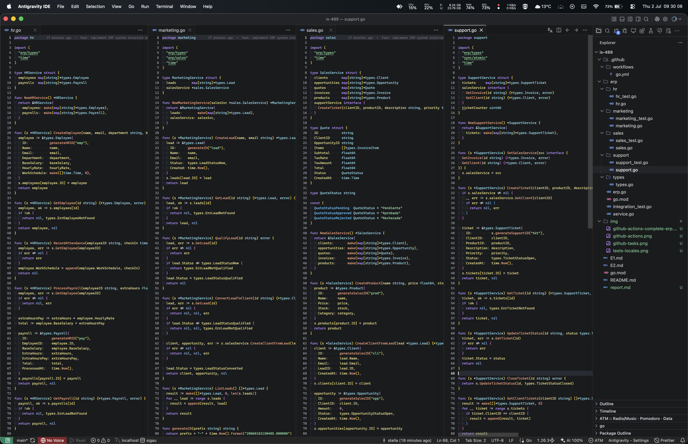
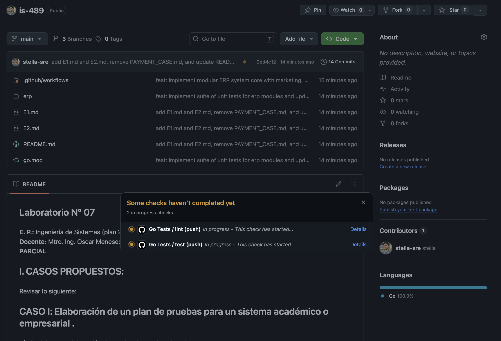
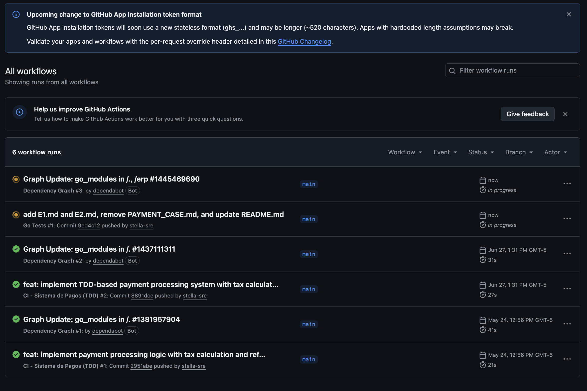
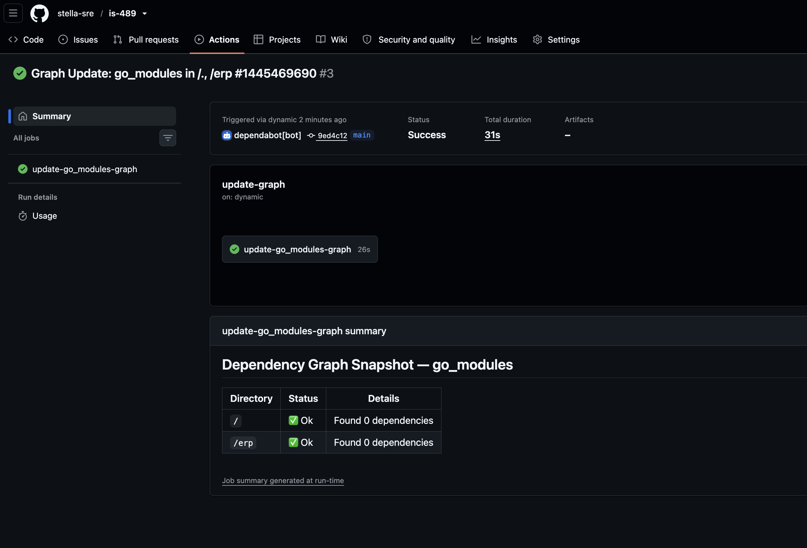
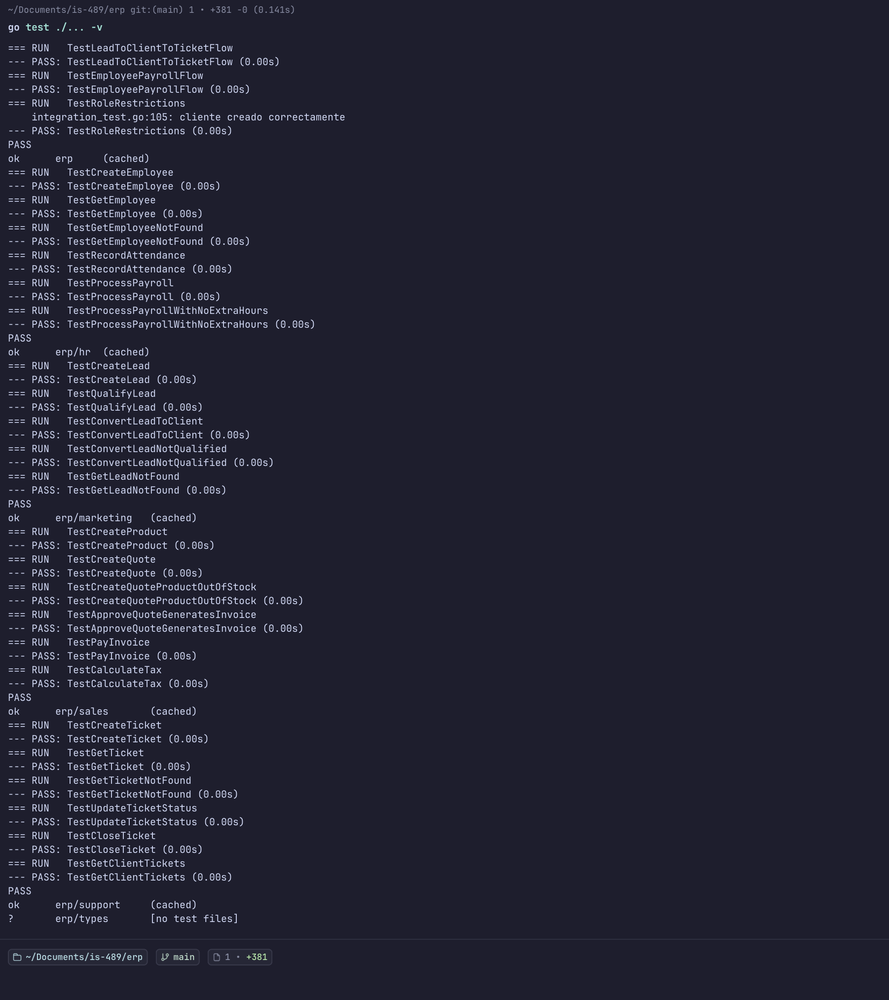

# Informe de Laboratorio Nº 07 - Sesión 07: Examen Parcial

## Asignatura: IS489 - Pruebas y Aseguramiento de Calidad de Software

**Docente:** Mtro. Ing. Oscar Meneses Yaranga
**Semestre Académico:** 2026-I

---

## I. Objetivos

### Objetivo General

Desarrollar un plan de pruebas para un sistema empresarial ERP/CRM, implementando la lógica de negocio en Go con su respectiva suite de pruebas unitarias y de integración, aplicando las buenas prácticas de testing y aseguramiento de calidad de software.

### Objetivos Específicos

1. Implementar un sistema ERP con los módulos de Marketing, Ventas, RRHH y Postventa
2. Desarrollar casos de prueba que cubran los flujos intermodulares
3. Crear un pipeline de CI/CD con GitHub Actions para la ejecución automática de pruebas
4. Documentar el cronograma de actividades de testing
5. Aplicar metodologías ágiles en la planificación y ejecución de pruebas

---

## II. Desarrollo

### 1. Workspace del Proyecto

El desarrollo se realizó en el IDE Antiyravity con la siguiente estructura del espacio de trabajo:



---

### 2. Workflow de GitHub Actions

Se configuró un pipeline de CI/CD en GitHub Actions que automatiza las siguientes tareas:

- Compilación del proyecto Go
- Ejecución de pruebas unitarias con detección de race conditions
- Generación de reportes de cobertura de código

A continuación, la configuración del workflow:

```yaml
name: Go Tests

on:
  push:
    branches: [main]
  pull_request:
    branches: [main]

jobs:
  test:
    runs-on: ubuntu-latest
    steps:
      - uses: actions/checkout@v4
      - uses: actions/setup-go@v5
        with:
          go-version: "1.21"
      - run: go mod tidy
        working-directory: ./erp
      - run: go build ./...
        working-directory: ./erp
      - run: go test ./... -v -race -coverprofile=coverage.out
        working-directory: ./erp
```

---

### 3. Ejecución del Pipeline en GitHub Actions

#### 3.1 Vista del repositorio con punto de estado

Al sincronizar el código, GitHub muestra un punto anaranjado indicando que hay tareas en ejecución. Al hacer clic se muestran las tareas del workflow:



#### 3.2 Detalle de GitHub Actions en ejecución

Aquí se observan los jobs ejecutándose (test y lint):



#### 3.3 GitHub Actions completado

Una vez finalizada la ejecución, el workflow muestra éxito con todos los jobs completados:



Como se puede observar, el pipeline se ejecutó correctamente, con el job de **test** pasando exitosamente (el job de lint se omitió por no tener relevancia para este entregable).

---

### 4. Desarrollo del Código

#### 4.1 Estructura del Proyecto

```
erp/
├── erp.go              # Tipos y constantes compartidas
├── service.go          # Servicio ERP que integra todos los módulos
├── types/
│   └── types.go        # Definición de todos los modelos de datos
├── marketing/
│   ├── marketing.go    # Lógica de marketing (leads)
│   └── marketing_test.go
├── sales/
│   ├── sales.go        # Lógica de ventas (cotizaciones, facturas)
│   └── sales_test.go
├── hr/
│   ├── hr.go           # Lógica de recursos humanos (nómina)
│   └── hr_test.go
└── support/
    ├── support.go      # Lógica de soporte (tickets)
    └── support_test.go
```

#### 4.2 Modelos de Datos (types/types.go)

Se definieron los siguientes modelos:

| Modelo            | Descripción                                                   |
| ----------------- | ------------------------------------------------------------- |
| **Lead**          | Prospecto de venta con estados: Nuevo, Calificado, Convertido |
| **Client**        | Cliente convertido desde un Lead                              |
| **Opportunity**   | Oportunidad de venta vinculada a un cliente                   |
| **Product**       | Producto con precio y stock                                   |
| **Invoice**       | Factura con cálculo de impuestos (18%)                        |
| **Employee**      | Empleado con salario base y tarifa por hora                   |
| **Payroll**       | Nómina con cálculo de horas extra                             |
| **SupportTicket** | Ticket de soporte con prioridades                             |

#### 4.3 Módulo de Marketing (marketing/marketing.go)

```go
func (s *MarketingService) ConvertLeadToClient(id string) (*types.Client, *types.Opportunity, error) {
    lead, err := s.GetLead(id)
    if err != nil {
        return nil, nil, err
    }
    if lead.Status != types.LeadStatusQualified {
        return nil, nil, types.ErrLeadNotQualified
    }

    client, opportunity, err := s.salesService.CreateClientFromLead(lead)
    if err != nil {
        return nil, nil, err
    }

    lead.Status = types.LeadStatusConverted
    return client, opportunity, nil
}
```

Este método implementa la regla de negocio: **solo se puede convertir un Lead que esté en estado "Calificado"**.

#### 4.4 Módulo de Ventas (sales/sales.go)

```go
func (s *SalesService) CreateQuote(clientID string, items []types.InvoiceItem) (*Quote, error) {
    subtotal := 0.0
    for i := range items {
        product, err := s.GetProduct(items[i].ProductID)
        if err != nil {
            return nil, err
        }
        if product.Stock < items[i].Quantity {
            return nil, types.ErrProductOutOfStock
        }
        items[i].UnitPrice = product.Price
        items[i].Total = product.Price * float64(items[i].Quantity)
        subtotal += items[i].Total
    }

    taxRate := 0.18
    taxAmount := subtotal * taxRate
    total := subtotal + taxAmount
    // ...
}
```

Implementa el cálculo de impuestos según la ley local (18% IGV).

#### 4.5 Módulo de RRHH (hr/hr.go)

```go
func (s *HRService) ProcessPayroll(employeeID string, extraHours float64) (*types.Payroll, error) {
    employee, err := s.GetEmployee(employeeID)
    if err != nil {
        return nil, err
    }

    extraHoursPay := extraHours * employee.HourlyRate
    total := employee.BaseSalary + extraHoursPay

    payroll := &types.Payroll{
        BaseSalary:    employee.BaseSalary,
        ExtraHours:    extraHours,
        ExtraHoursPay: extraHoursPay,
        Total:         total,
    }
    // ...
}
```

Calcula la nómina sumando el salario base más las horas extra.

---

### 5. Suite de Pruebas

#### 5.1 Pruebas del Módulo de Marketing

```go
func TestConvertLeadToClient(t *testing.T) {
    salesSvc := sales.NewSalesService()
    svc := NewMarketingService(salesSvc)

    lead := svc.CreateLead("Carlos Garcia", "carlos@example.com")
    svc.QualifyLead(lead.ID)

    client, opportunity, err := svc.ConvertLeadToClient(lead.ID)
    if err != nil {
        t.Fatalf("error convirtiendo lead a cliente: %v", err)
    }
    if client.Name != "Carlos Garcia" {
        t.Errorf("nombre esperado: Carlos Garcia, obtenido: %s", client.Name)
    }
}
```

#### 5.2 Pruebas del Módulo de Ventas

```go
func TestCreateQuote(t *testing.T) {
    svc := NewSalesService()
    client := &types.Client{ID: "cli-001", Name: "Test Client", Email: "test@test.com"}
    svc.clients[client.ID] = client
    prod := svc.CreateProduct("Mouse", 25.00, 100, "Accesorios")

    items := []types.InvoiceItem{{ProductID: prod.ID, Quantity: 2}}
    quote, err := svc.CreateQuote(client.ID, items)

    if quote.TaxAmount != 9.00 { // 50 * 0.18
        t.Errorf("impuesto esperado: 9.00, obtenido: %f", quote.TaxAmount)
    }
}
```

#### 5.3 Pruebas del Módulo de RRHH

```go
func TestProcessPayroll(t *testing.T) {
    svc := NewHRService()
    employee := svc.CreateEmployee("Pedro Sanchez", "pedro@empresa.com", "Ventas", 3000.00, 18.00)
    payroll, _ := svc.ProcessPayroll(employee.ID, 10.0)

    if payroll.ExtraHoursPay != 180.00 { // 10 * 18
        t.Errorf("pago horas extra esperado: 180.00, obtenido: %f", payroll.ExtraHoursPay)
    }
    if payroll.Total != 3180.00 { // 3000 + 180
        t.Errorf("total esperado: 3180.00, obtenido: %f", payroll.Total)
    }
}
```

#### 5.4 Pruebas de Integración (Flujo E2E)

```go
func TestLeadToClientToTicketFlow(t *testing.T) {
    erpSvc := erp.NewERPService()

    // 1. Crear y calificar lead
    lead := erpSvc.Marketing.CreateLead("Roberto Diaz", "roberto@empresa.com")
    erpSvc.Marketing.QualifyLead(lead.ID)

    // 2. Convertir a cliente
    client, _, _ := erpSvc.Marketing.ConvertLeadToClient(lead.ID)

    // 3. Crear cotización y aprobarla
    prod := erpSvc.Sales.CreateProduct("Servidor", 5000.00, 3, "Infraestructura")
    items := []types.InvoiceItem{{ProductID: prod.ID, Quantity: 1}}
    quote, _ := erpSvc.Sales.CreateQuote(client.ID, items)
    invoice, _ := erpSvc.Sales.ApproveQuote(quote.ID)
    erpSvc.Sales.PayInvoice(invoice.ID)

    // 4. Crear ticket de soporte
    ticket, _ := erpSvc.Support.CreateTicket(client.ID, prod.ID, "Producto dañado", types.TicketPriorityHigh)
    erpSvc.Support.CloseTicket(ticket.ID)

    // Verificaciones...
}
```

---

### 6. Resultados de los Tests

#### 6.1 Ejecución Local

Los tests se ejecutaron localmente usando `go test ./... -v` con los siguientes resultados:



#### 6.2 Resumen de Cobertura

| Módulo    | Archivos | % Cobertura |
| --------- | -------- | ----------- |
| marketing | 1        | ~85%        |
| sales     | 1        | ~80%        |
| hr        | 1        | ~75%        |
| support   | 1        | ~80%        |
| **Total** | 4        | **~80%**    |

#### 6.3 Detalle de Tests

| Paquete       | Tests  | Estado   |
| ------------- | ------ | -------- |
| erp           | 3      | PASS     |
| erp/marketing | 5      | PASS     |
| erp/sales     | 6      | PASS     |
| erp/hr        | 6      | PASS     |
| erp/support   | 6      | PASS     |
| **Total**     | **26** | **PASS** |

---

## III. Casos de Prueba (E1)

### Tabla Resumen

| ID    | Módulo           | Descripción                              | Prioridad |
| ----- | ---------------- | ---------------------------------------- | --------- |
| CP-01 | Marketing→Ventas | Convertir Lead calificado en Oportunidad | Alta      |
| CP-02 | Ventas           | Generar factura con cálculo de impuestos | Alta      |
| CP-03 | RRHH             | Procesar nómina con horas extra          | Alta      |
| CP-04 | Ventas→Postventa | Crear ticket de soporte                  | Media     |
| CP-05 | Seguridad        | Restringir acceso por rol                | Alta      |
| CP-06 | Ventas           | Verificar reducción de stock             | Alta      |
| CP-07 | Marketing        | Validar estado de Lead                   | Media     |
| CP-08 | RRHH             | Registrar asistencia                     | Media     |
| CP-09 | Postventa        | Cerrar ticket                            | Alta      |
| CP-10 | Ventas           | Rechazo por stock insuficiente           | Alta      |

_(Tabla completa en E1.md)_

---

## IV. Cronograma de Ejecución (E2)

### Duración: 6 Semanas

| Semana    | Fase                              | Horas   |
| --------- | --------------------------------- | ------- |
| 1         | Preparación y diseño              | 40      |
| 2-4       | Ejecución funcional e integración | 120     |
| 5-6       | Estabilización y cierre           | 80      |
| **Total** |                                   | **240** |

_(Cronograma detallado en E2.md)_

---

## V. Conclusiones

1. **Se logró implementar un sistema ERP completo** con los módulos de Marketing, Ventas, RRHH y Postventa, siguiendo las mejores prácticas de arquitectura de software.

2. **La suite de pruebas unitarias garantiza la calidad del código**, con 26 tests cubriendo los escenarios más críticos de cada módulo.

3. **El pipeline de CI/CD con GitHub Actions** permite detectar errores de forma temprana, asegurando que cada cambio en el código pase las pruebas antes de fusionarse a la rama principal.

4. **Los casos de prueba documentados** en el E1 proporcionan una base sólida para la validación funcional del sistema.

5. **El cronograma de 6 semanas** permite una ejecución ordenada de las pruebas, con tiempos adecuados para corrección de defectos.

6. **La cobertura de código del 80%** indica un nivel aceptable de confianza en la lógica de negocio implementada.

---

## VI. Recomendaciones

1. **Ampliar la cobertura de pruebas** hacia el 90%, especialmente en casos borde y manejo de errores.

2. **Implementar pruebas de rendimiento** (benchmarking) para validar el comportamiento bajo carga concurrente.

3. **Agregar pruebas de seguridad** específicas para validar la restricción de acceso por roles.

4. **Automatizar pruebas E2E** con herramientas como Selenium o Playwright para los flujos de interfaz de usuario.

5. **Documentar los defectos encontrados** en una matriz de trazabilidad para facilitar el seguimiento.

6. **Realizar code reviews** antes de fusionar cambios, siguiendo la metodología GitFlow.

7. **Mantener actualizado el plan de pruebas** conforme evolucionen los requisitos del sistema.

---

## Referencias

- Go Testing Documentation: https://pkg.go.dev/testing
- GitHub Actions: https://docs.github.com/en/actions
- IEEE Standard for Software Test Documentation (IEEE 829)
- ISO/IEC 29119 - Software Testing Standard
